# 1week (ITEM.1~6)

## ITEM 1 . 생성자 대신 정적 패터리 메서드를 고려하라

클래스 생성자와 별도로 정적팩터리메서드(static factory metod)를제공할수있다.

정적 팩터리 메서드가 생성자 보다 좋은 장점 5가지를 알아보자.

1. 이름을 가질 수 있다.  ⇒ 더 편리하게 의미를 파악할 수 있다
2. 호출 시마다 인스턴스를 새로 만들지 않아도 된다. ⇒ 플라이웨이트 패턴과 같이 생성된 객체를 반환할 수 있다. (싱글톤 객체로 만들수도, 인스턴스 화 불가로 만들 수도 있다.)
3. 반환 타입의 하위 타입 객체를 반환할 수 있는 능력 있다(객체의 클래스를 자유롭게 선택할 수 있는 ‘엄청난 유연성’을 선물한다.
4. 입력 매개변수에 따라 매번 다른 클래스의 객체를 반환할 수 있다.
5. 정적 팩터리 메서드를 작성하는 시점에는 반환할 객체의 클래스가 존재하지 않아도 된다.

단점

1. 상속을 하기 위해 public 이나 procted 생성자가 필요하니 정적 팩터리 메서드만 제공하면 하위 클래스를 만들 수 없다.
2. 정적 팩터리 메서드는 프로그래머가 찾기 어렵다

   ⇒ 생성자 만큼 명확하게 생성이 드러나지 않아 인스턴스 방법을 직접확인해야한다.

### **핵심정리**

정적팩터리메서드와 public 생성자는 각자의 쓰임새가 있으니 상대적인 장단점을 이해하고사용하는것이좋다. 그렇다고 하더라도 정적팩터리를 사용하는게 유리한경우가 더 많으므로 무작정 public 생성자를 제공하던 습관이 있다면 고치자.

## ITEM 2.  생성자에 매개변수가 많다면 빌더를 고려하라.

매개변수가 많은경우 개발자들의 해결방법

### 점층적 생성자 패턴

⇒ 확장하기 어렵다

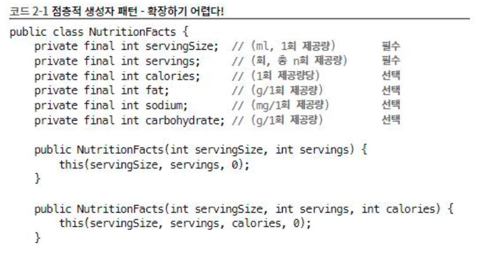  

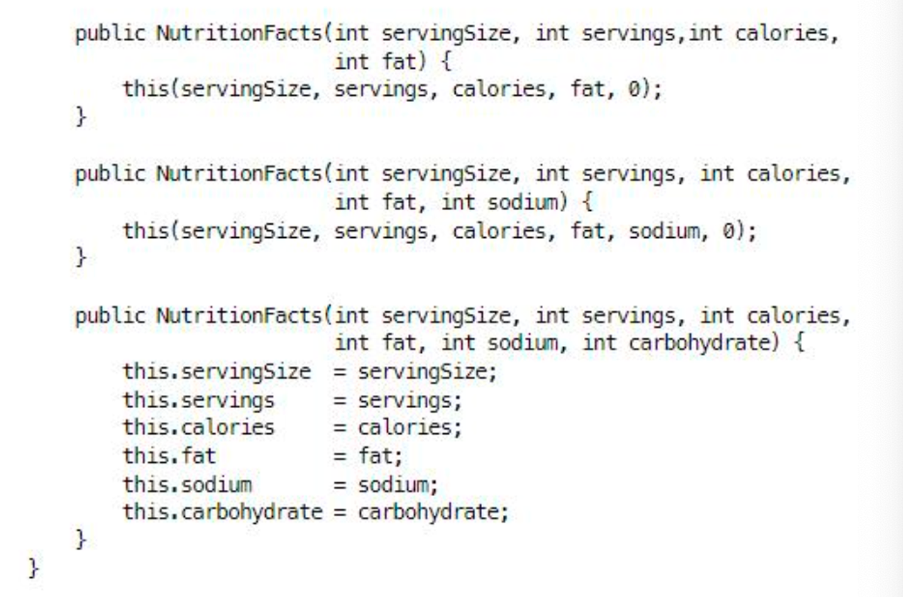  

### 자바빈즈

⇒ 객체 하나를 만들려면 메서드를 여러개 호출해야하고 객체가 완전히 생성되기 전까지는 일관성이 무너진 상태에 놓이게 된다.

⇒ 일관성이 무너지는 문제로 인해 클래스를 불변으로 만들 수 없다.

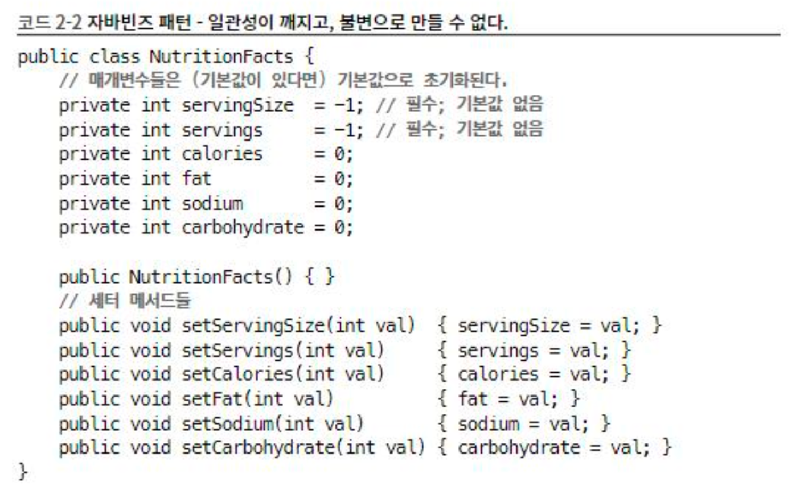  

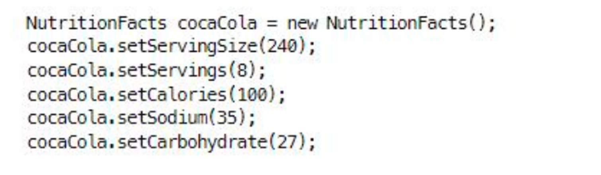  

### 빌더패턴의 등장~!~!

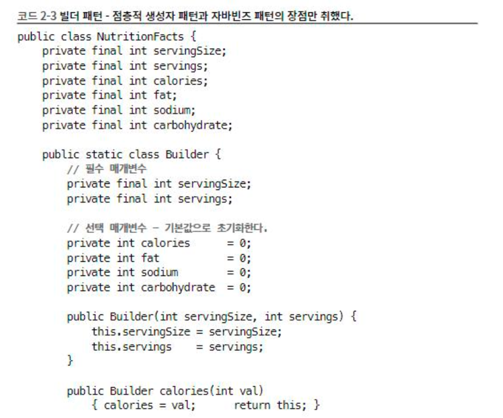  

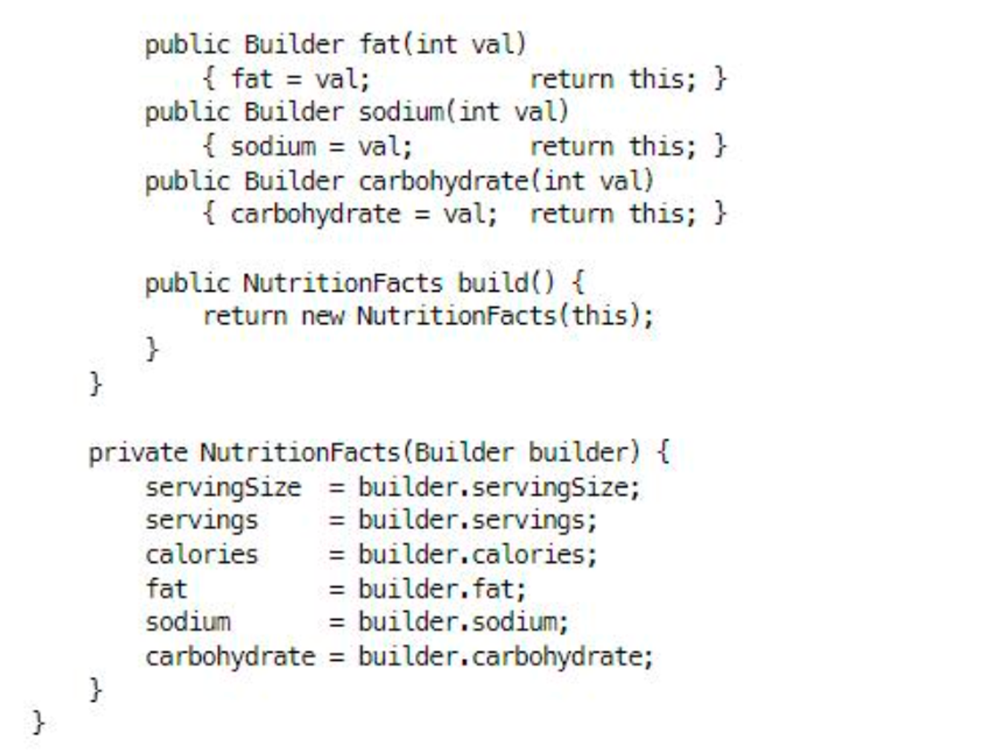  

장점

1. 선택적 매개변수를 흉내내것이다.
2. 계층적으로 설계된 클래스와 함께 쓰기에 좋다.
    1. 각 하위 클래스의 빌더가 정의한 build 메서드는 해당하는 구체 하위 클래스를 반환하도록 설계한다. 이렇게 하위클래스의 메서드가 상위 클래스의 메서드가 정의한 반환 타입이 아닌, 그 하위 타입을 반환하는 기능을 공변반환 타이핑이라한다.
    2. 이렇게 빌터패턴을 이용하면 가변인수 매개변수를 여러 개 사용할 수 있다.

이를 통해 상당히 유연하게 만들어 낼 수 있다. 객체마다 부여되는 일련번호와 같은 특정 필드는 빌더가 알아서 채우도록 할 수 있다.

단점

성능에 민감한 상황에서 문제가 될 수 있다

### 결론 
점층적 생성자 패턴보다 코드가 장황해서 매개변수가 4개 이상이 경우에 값어치를 한다. (보통 계속해서 API는 매개별수가 늘어나는것을 고려하자)

⇒ 처음에는 생성자나 정적 팩터리 방식으로 시작하다가 매개별수가 많아지고 빌더로 바꾸는것보다는 처음부터 빌터로 시작하는것이 좋을 편이 나을때가 많다.

## ITEM 3. private 생성자나 열거 타입으로 싱글턴임을 보증하라

싱글턴 : 인스턴스를 오직 하나만 생성할 수 있는 클래스를 말한다. ⇒ 클라이언트 테스트가 어려워진다.

싱글턴을 만드는 방식

생성자 private을하고 하나만 public static 멤버를 하나 마련해둔다.

### public static 멤버가 final 필드인 방식

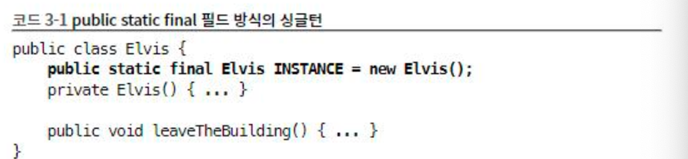  

1. 해당 클래스가 싱클턴임이 명확하게 드러난다.
2. 간결하다.

### 정적 팩터리 방식의 싱클턴

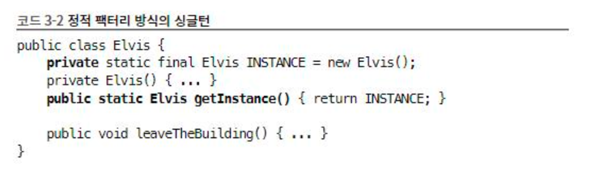  

1. 마음이 바뀌면 싱클턴이게 하지 않고 스레드 별로 다른 인스턴스를 넘기게 할 수 있다.
2. 원한다명 정적 팩터리를 제네릭 싱글턴 팩터리로 만들 수 있다.
3. 정적 팩터리 메서드를 참조몰 공급자로 사용할 수 있다

만약 둘 중 하나의 방식으로 만들 싱글턴 클래스를 직렬화 하려면?

단순히 serializable로 구현한다고 선언하는것으로 부족하고 모든 인스턴트를 일시적이라 선업하고 readResolved를 이용해 제고해야한다. 이렇게 하지 않으면 직렬화된 인스턴스를 역직렬화 할때마다 새로운 인스턴스가 만들어진다.

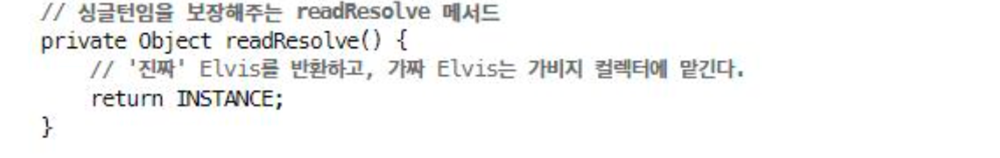  

### 열거 타입을 선언한다.

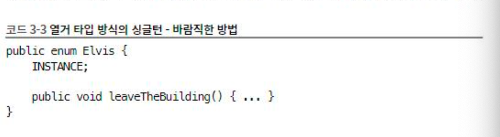  

이렇게 하는경우 직렬화 하지 않아도 되고 리플렉션 공격에서도 제2의 인스턴스가 만들어지는것을 막아준다.

### 결론

대부분의 상황에서는 원소가 하나뿐인 열거타입이 싱글턴을 만드는것이 가장 좋은 방법이다. 하지만 만들려는 싱글턴이 Enum외의 클래스를 상속해야한다면 이 방법은 사용할수 없다.

## ITEM 4. 인스턴스화를 막으려거든 private 생성자를 사용하라

정적 메서드와 정적 필드만을 담을 클래스를 만드는 경우, final 클래스와 관련한 메서드를 모아놓은 경우. 정적 멤버만 담은 유틸리티 클래스는 인스턴스로 만들어 쓰려고 설계한다. 하지만 이경우 생성자를 생성하기 때문에 이를 막아주어야 한다.

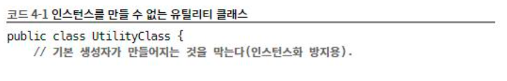

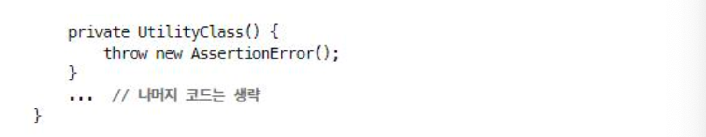

추상클래스로 만드는것으로는 인스턴스화를 막을 수 없다. 하위 클래스를 만들어 인스턴스화 하면 그만이다. 컴파일러가 기본생성자를 만드는 경우는 오직 명시된 생성자가 없을떄뿐이니 private 생성자를 추가하면 클래스의 인스턴스화를 막을 수 있다.

이를통해 실수로라도 생성자를 호출하지 않도록 해준다.

또한 이 방식은 상속을 불가능하게 하는 효과도 있다.

모든 생성자는 명시적이든 묵시적이든 상위 클래스의 생성자를 호출하게 되는데, 이를 private 으로 선언 했으니 하위 클래스가 상위 클래스의 생성자에 접근할 길이 막혀버린다.

### 결론

정적 메서드, 정적필드만을 담을 클래스를 만드는 경우, final만 있는 경우와 같이 인스턴스화를 막고 싶은경우라면 생성자 자체를 private으로 선언해라.

## ITEM 5. 자원을 직접명시하지말고 의존 객체주입을 사용하라

사용하는 자원에 따라 동작이 달라지는 클래스에는 정적 유틸리티 클래스나 싱글턴 방식이 적합하지 않다. ⇒ 이런 경우 적합한 패턴이 인스턴스를 생성할때 생성자로 필요 자원을 넘겨주는 방식이다. 의존객체의 한 형태로 맞춤법 검사기를 생성할 때 의존객체인 사전을 주입해주면된다.

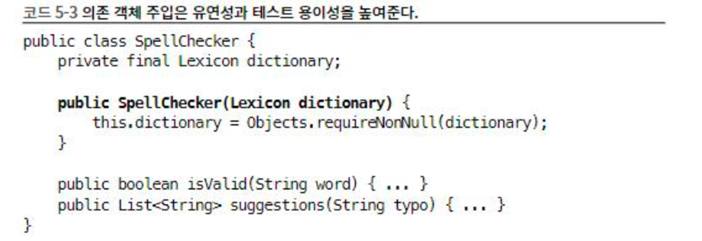

의존객체 주입방법은 정적 패터리, 빌더에 모두 응용할 수 있다.

이 방식을 활용해서 클라이언트는 자신이 명시한 타입의 하위 타입이라면 무엇이든 생성할 수 있는 팩터리를 넘길 수 있다.

의존객체주입이 유연성과 테스트 용이성을 개선해주긴 하지만 의존성이 수천개인 큰 프로젝트에서는 코드를 어지럽게 한다.

대거, 주스, 스프링과 같은 의존 객체 주입 프레임 워크를 사용하면 이런 어질러짐을 해결할 수 있다.

### 결론

클래스가 내부적으로 하나이상의 자원에 의존하고 그 자원이 클래스 동작에 영향을 준다면 싱클턴과 정적 유틸리티클래스는 사용하지 않는 것이 좋다. 이 경우에는 의존 객체 주입방법을 사용해 클래스의 유연성, 재 상용성, 테스트 용이성을 개선할 수 있다.

## ITEM 6. 불필요한 객체 생성을 피하라

### 스트링

똑같은 기능의 객체를 매번 생성하기 보다는 객체 하나를 재 사용하는 편이 나을 때가 많다.

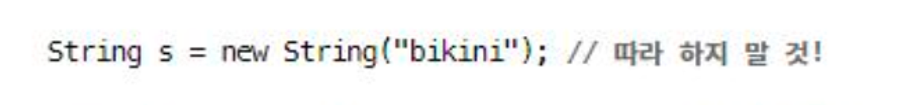

이 경우는 실행될때 마다 String 인스턴스를 새로 생성한다.

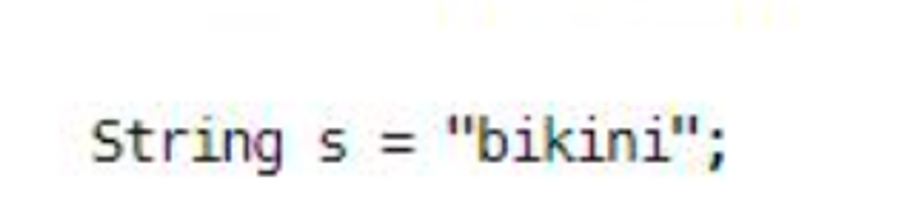

이 코드는 새로운 인스턴스를 매번 만드는 대신 하나의 String 인스턴스를 사용한다. 또한 이 방법을 사용하면 같은 가상머신 내에서 똑같은 문자형 리터럴을 사용하는 모든 코드가 같은 객체를 재사용함이 보장된다.

예컨대 Bootean(string) 생성자대신 Boolean.valueof(string) 팩터리메서드를사용 하는것이좋다

생성자는 호출때마다 새로운 객체를 만들지만 팩터리 메서드는 전혀 그렇지 않다. 가변 객체라 해도 사용중에 변경되지 않을 것임을 안다면 재 사용할 수 있다.

또한 생성 비용이 아주 비싼 객체라면 캐싱해서 재사용하길 권장한다. 이 예로는 String.matches는 정규표현식을 확인하는 쉬운 방법이지만 성능이 중요한 상황에서는 반복해 사용하기가 적합하지 않다. 메서드가 내부에서 만드는 정규표현식용 Pattern 인스턴스는 한번 사용되고 가비지 컬렉션 대상이 된다. Pattern 은 입력받은 정규효현식에 해당하는 유한 상태머신을 만들기에 인스턴스 생성 비용이 높다.

이를 개선하기 위해 정규표현식을 표현하는 Pattern 인스턴스를 클래스 초기화 과정에서 직접 생성해 캐싱해두고 나중에 호출시마다 이 인스턴스를 사용한다.

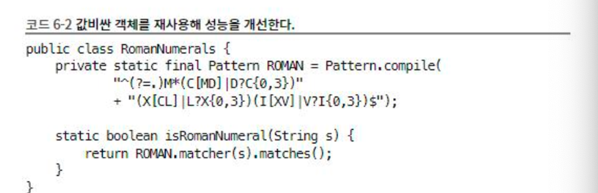

위의 코드를 지연 초기화를 하여 처음 호출시에  초기화 하도록 할 수 있지만 추천하지 않는다.

객체가 불변이라면 재사용해도 안전함이 명백하다.

이는 즉 Map 인터페이스의 keySet메서드는 Map 객체안의 키 전부를 담은 Set 뷰를 반환한다. 이는 객체가 불변하는경우가 아니기에 뷰 객체는 하나만 만들어 해당 인스턴스를여러개 만드는 경우와 같은것이다.

### 오토박싱

오토박싱은기본타입과 그에대용하는 박싱된기본타입의구분을흐려주지만,완전히없애주는것은아니다

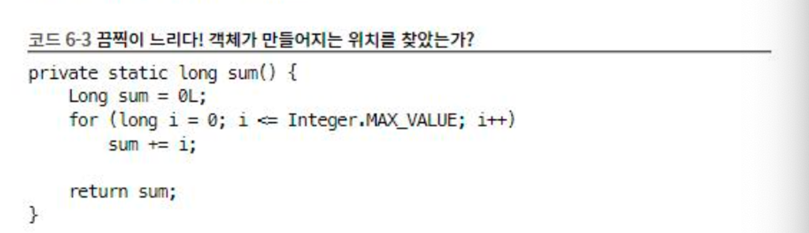
박싱된기본타입보다는기본타입을사용하고,의도치않은 오토박싱이 숨어들지 않도록 주의하자.

### 결론

객체 생성은 비싸니 피해야 한다로 오해하면 안된다.  특히 요즘의 JVM에서는 객체를 회수하는일이 크게 부담이 되지 않는다.

이와 마찬가지로 아주 무거운 객체가 아닌이상 pool을 만들지는 말자.

데이터 베이스의 경우에는 poll을 만들어 재사용 하는것이 낫지만 일반적으로 객체 풀은 코드를 헷갈리게 하고 메모리 사용량을 높여 성능을 떨어뜨린다.

해당 아이템은 방어적 복사와 대조적이다.

방어적복사가 필요한 상황에서 객체를 재사용 했을때의 피해가, 필요없는 객체를 반복 생성했을때의 피해보다 훨씬 크다는사실을기억하자. 불필요한 객체생성은 그저 코드 형태와 성능에만 영향을 준다.