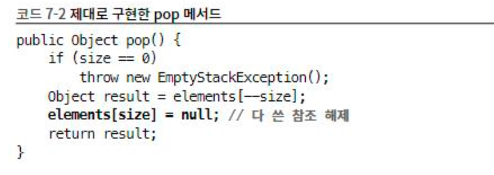
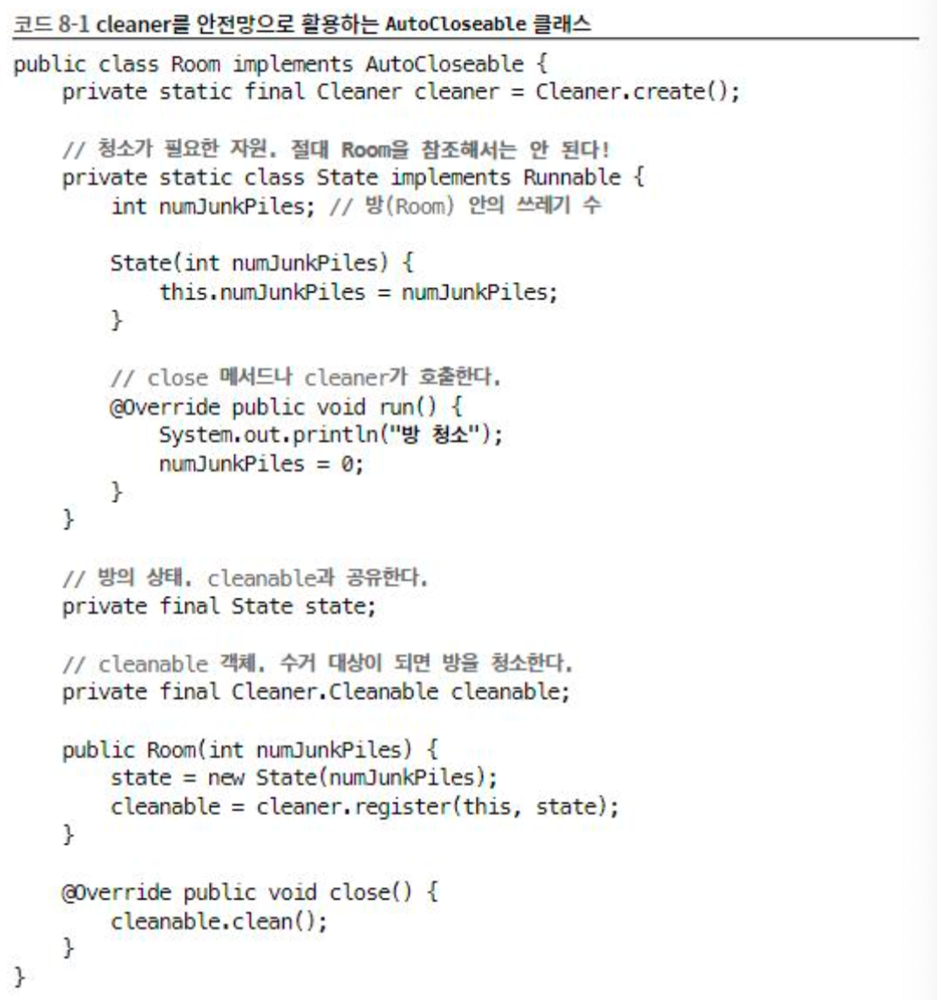
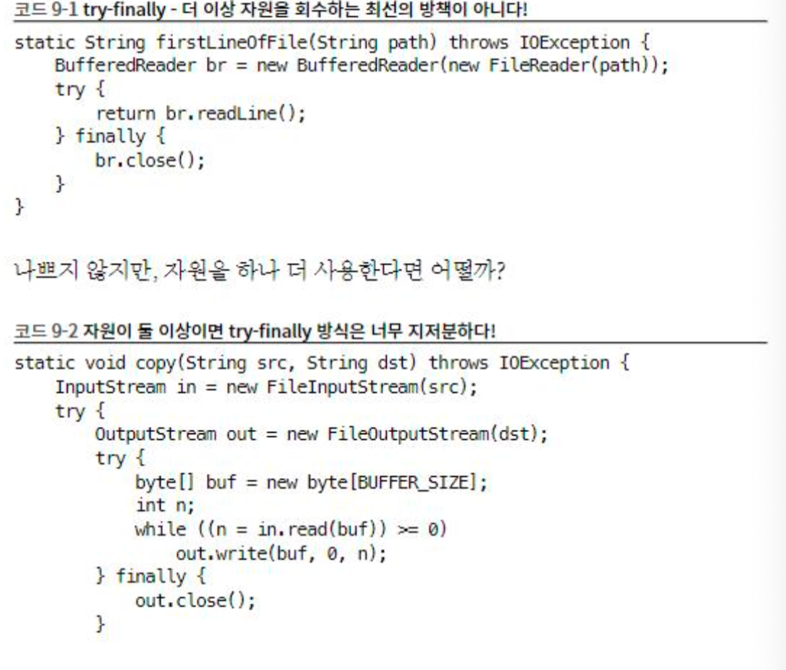
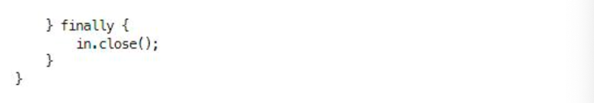
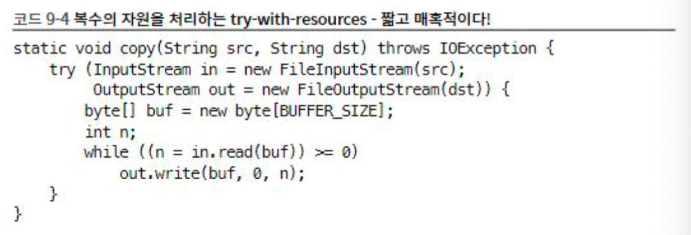
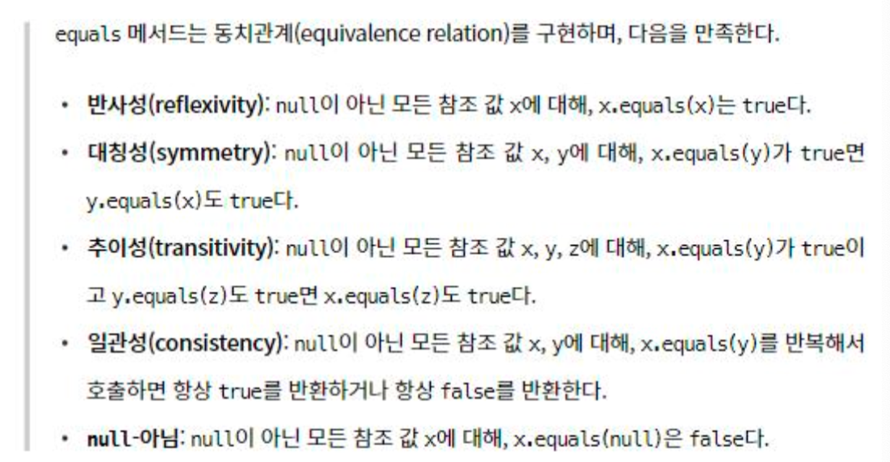
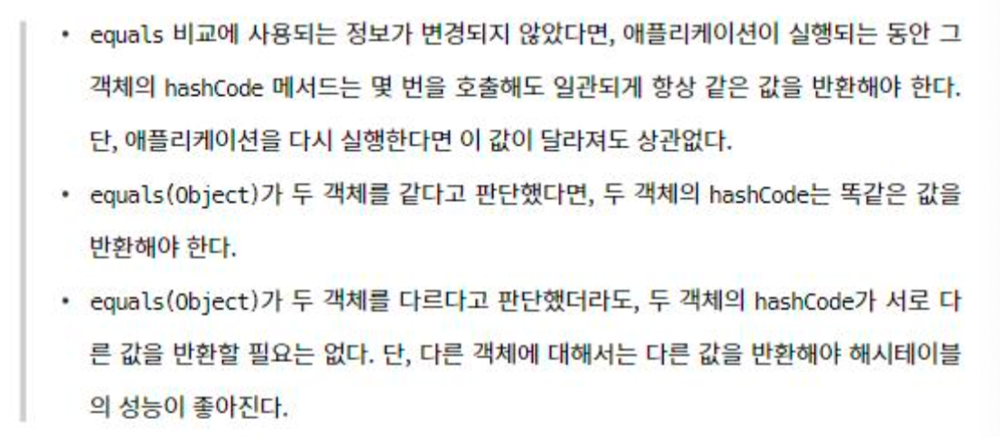
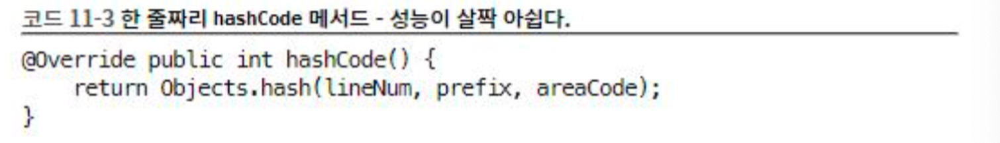

# 2week

## Item 7 다 쓴 객체 참조를 해제하라

가비지 컬렉션 언어에서는 메모리 누수를 찾기가 아주 까다롭다. 객체 참조 하나를 살려두면 가비지 컬렉터는 그 객체 뿐만 아니라 그 객체가 참조하는 모든객체를 회수해 가지 못한다. 그래서 단 몇 개의 객체가 매우 많은 객체를 회수되지 못하게 할 수 있고 잠재적으로 성능에 악영향을 줄 수 있다.

해법은 간단한다. 해당 참조를 다 썼을 때 null처리(참조 해제)하면 된다.

스택 클래스에서 각 원소의 참조가 더 이상 필요 없어 지는 시점은 스택에서 꺼내질때 null처리를 진행하면 된다. 또한 null 처릴를 진행함으로써 삭제된 객체를 참조하려 할때 NullPointerException을 던지며 종료시키게 하여 사전에 문제상황을 예방할 수 있다.

그렇다고 모든객체 해제시에 null처리를 하지는 마라. 객체 참조를 null 처리하는 일은 예외적인 경우여야 한다. 다 쓴 참조를 해제하는 가장 좋은 방법은 그 참조를 담은 변수를 유효범위 밖으로 밀어내는 것이다.

stack 클래스는 왜 메모리 누수에 취약한걸까? 바로 스택이 자기 메모리를 직접 관리하기 떄문이다. 이 스택은 elements 배열로 저장소 풀을 만들어 원소들을 관리한다.

문제는 가비지 컬렉터는 배열내의 활성영역과 비활성영역을 파악할 길이 없기 때문이다. 따라서 가비지 컬렉터에게 어떠한 영역이 비 활성 영역임을 이야기 해주어야 한다.

일반적으로 자기 메모리를 직접 관리하는 클래스라면 프로그래멋는 항시 메모리 누수에 주의 해야 한다. 원소를 다 사용한 즉시 그 원소가 참조한 객체들을 다 null 처리 해줘야 한다.

캐시 영역도 메모리 누수를 일으키는 주범이다. 객체를 다 쓴뒤에 그냥 두는영우가 있다.  WeakHashMap을 사용해 캐시를 만들자. 다 쓴 엔트리는 즉시 삭제될것이다. 단 WeakHashMap은 이러한 상황에서만 유용하다.  캐시를 만들 때 보통은 캐시 엔트리의 유효기간을 정확히 정의하기어렵기 때문에 시간이 지날 수록 엔트리의 가치를 떨어뜨리는 방식을 흔히 사용한다. 이때 엔트리를 청소하기 위해 백그라운드 스레드를 사용하거나 캐시에 새 엔트리를 추가할 때 부수적으로 수행하는 방법이 있다.

리스너, 콜백도 메모리 누수를 일으킨다. 클라이언트가 콜백을 등록하게 명확히 해지 하지 않는다면 계속 쌓여 간다. 이럴 때 콜백을 약한 참조로 저장하면 가비지 컬렉터라 즉시 수거해간다. 예를 들면 WeakHashMap에 키로 저장하면 된다.

## Item 8 finalizer 와 cleaner 사용을피하라

- 다시 읽기

자바에서 제공하는 두가지 객체 소멸자 finalizer, cleaner

### finalizer

예측할 수 없고 상황에 따라 위험할 수 있다.

기본적으로 쓰지 않아야 한다.

### cleaner

finalizer보다는 덜 위험하지만, 여전히 예측할 수 없고, 느리고, 일반적으로 불 필요하다.

finalizer과 cleaner는 즉시 수행된다는 보장이 없다. 따라서 finalizer과 cleaner로는 제떄 실행 되어야 하는 작업은 절대 할 수 없다. 만약 파일 닫기를 finalizer과 cleaner로 실행한다면 시스템이 동시에 열 수 있는 파일의 개수에 한계가 있어 오류를 일으킬 수 있따. finalizer과 cleaner를 수행하는 것은 가비지 컬렉터의 알고리즘에 달려있다.

finalizer 스레드는 다른 어플리케이션 스레드 보다 우선순위가 낮아서 실행될 기회를 제대로 얻지 못할 수 있다. 자바언어 명세는 어떤 스레드가 finalizer를 수행할지 명시하지 않으니 방법은 finalizer를 실행하지 않는 방법 뿐이다. cleanerdms 자신을 수행할 스레드를 제어할 수 있지만 여전히 백그라운드에서 수행되며 가비지 컬렉터의 통제하에 있어 즉각 수행되리라는 보장이 없다.

상태를 영구적으로 수정하는 작업에서는 절 대 finalizer과 cleaner에 의존해서는 안된다. 특히 데이터베이스와 같은 공유자원의 락을 finalizer과 cleaner에 맡기면 분산 시스템 전체가 해주지 않는다. finalizer는 또한 처리할 작업이 남았더라도 동작중 예외가 발생하면 중지한다.  또한 경고 조차 추적하지 않는다

또한 finalizer는 가비지 컬렉터의 효율도 떨어트린다. 이건 cleaner도 마찬가지다.

finalizer 을 사용한 클래스는 finalizer 공격에 노출되어 심각한 보안문제를 일으킬 수도 있따. finalizer 공격은 생성자나 직렬화 과정에서 예외 상황 발생시 생성되단 만 객체에서 악의적인 하위클래스의 finalizer가 수행될 수 있게 된다는 것이다.

final이 아닌 클래스를 finalizer 공격으로 부터 방어하려면 아무일도 하지 않는 finalize 메서드를 만들고 final로 선언하자.

대안으로 AutoCloseabel을 구현해주고 클라이언트에서 인스턴스를 다 쓰고 나면 close 메서드를 호출하면 된다.

그럼 finalizer과 cleaner는 언제 사용할까?

1. 자원의 소유자가 close를 호출하지 않는 것에 대비한 안정망 영활(반환을 아예 안하는것보다는 하는것이 낫기에)
    1. FileInputstream,Fileoutputstream, ThreadPoolExecutor 가대표적이다
2. 네이티브 피어와 연결된 객체
    1. 일반 자바 객체가 네이티브 메서드를 통해 기능을 위임한 네이티브 객체를 말한다. 네이티브 피어는 자바 객체가 아니기에 가비지 컬렉터는 그 존재를 알지 못한다. 이런 경우 finalizer과 cleaner를 사용하는 것이 적합하다.

   

## Item 9 try-finally 보다는 try-with-resources를 사용하라

자바 라이브러리에 close 메서드를 호출해 직접 닫아 줘야 하는 자원인 경우 기존에는 try-finally를 많이 사용했다.

예외는 try, finally 블록 모두에서 발생할 수 있는데, 파일 입력 자체에 문제가 발생한 경우는 예외가 try블록과 finally블록 모두에서 발생하여 스택 정보를 추적하기가 어렵다.

이러한 문제를 try-with-resources 덕에 모두 해결하였다.

이 구조를 사용하려면 해당 자원이 AutoCloseable 인터페이스를 구현해야한다. 이미 많은 자바 라이브러리와 서드 파티 라이브러리들이 AutoCloseable를 구현하거나 확장했다. 닫아야 하는 자원을 명시해야한다면 AutoCloseable을 구현해라

위 처럼 진행하면 문제를 진단하기도 훨씬 좋다.

또한 try-finally 처럼 try-with-resources에서도 catch절을 쓸 수 있다.

catch 절 덕에 try 문을 더 중첩하지 않고도 다수의 예외를 처리할 수 있다.

## Item 10 equals는 일반 규약을 지켜 재정의 하라

equals를 재정의 하는 경우 곳곳에 함정이 도사리고 있어 재정의 하지 않는 것이 좋다.

다음과 같은 상황이라면 재정의 하지 않는 것이 좋다.

1. 각 인스턴스가 본질적으로 고유하다.
2. 인스턴스의 논리적 동치성을 검사할 일이 없다
3. 상위 클래스에서 재 정의한 equals가 하위 클래스에도 딱 들어맏는다
4. 클래스가 private 이거나 package-private 이고 equals 메서드를 호출할 일이 없다.

equals를 재정의 해야하는 경우

1. 두 객체가 동일한지 판단해야하는 논리적 동치성을 확인해야하는경우인데 상위 클래스의 equals가 논리적 동치성을 비교하도록 재정의하지 않았을때 (주로 값 클래스 Integer, String 처럼 값을 표현하는 클래스)

equals 메서드 재정의 시 따라야 하는 조건

1. 반사성
2. 대칭성
3. 추이성
4. 일관성
5. null 아님

이를 구현하기 위해

1. ==연산자를사용해입력이자기자신의참조인지확인한다. 자기자신이면 true를반환한다. 이는 단순한 성능 최적화용으로, 비교작업이 복잡한 상황일때값어치를할것이다.
2. instanceof 연산자로입력이올바른타입인지확인한다. 그렇지않다면 false를반환한다. 이때의 올바른타입은 equals가 정의된 클래스인것이 보통이지만, 가끔은그클래스가구현한특정인터페이스가될수도있다. 어떤 인터페이스는 자신을 구현한 (서로 다른) 클래스끼리도 비교할 수 있도록equals규약을수정하기도한다. 이런인터페이스를 구현한클래스 라면equals에서(클래스가아닌)해당인터페이스를사용해야한다. Set, List , Map , Map.Entry 등의 컬렉  인터페이스들이 여기 해당한다.
3. 입력을 올바른타입으로 형변환한다.앞서 2번에서 instanceof검사를 했기때문에 이단계는100% 성공한다.
4. 입력 객체와 자기자신의 대응되는 ‘핵심’필드들이 모두 일치하는지 하나씩 검사한다. 모든 필드가 일치하면 true 하나라도 다르면 false를 반환한다.

float,double 을 제외한 기본 타입 필드는 ==으로 비교하고 참조타입 필드는 equals 메서드로 외는 comapare을 활용하여 비교한다.

어떤 필드를 먼저 비교하는냐가 equals의 성능을 좌우하기도 한다. 최상의 성능을 원한다면 다를 가능성이 큰거나 비교하는것이 싼것을 먼적 입력하자

주의 사항

1. equals를 재정의 할땐 hashcode도 반드시 재정의 하자.
2. 너무 복잡하게 해결하려 하지말고 필드들의 동치성만 검사해오 규약을 지킬 수 있다
3. Object외의 타입을 매개변수로 받는 equals메서드는 선언하지 말자

## Item 11 equasl를 재정의 한다면 hashCode도 재정의 하라

논리적으로 같은 객체는 같은 해시코드를 반환해야한다.

만약 앞선 equals를 통해 논리적으로 같은 객체를 만들었는데 hashCode의 값이 다르다면 문제가 될 수 있다. 그렇다고 모든 결과에 동일한 hash 값을 한다면 해시테이블이 연결리스트처럼 동작하여 객체가 많아지면 사용할 수 없다.

객체의 해시코드를 계산하는 방법은 다음과 같다.

1. 먼저, 객체의 첫 번째 핵심 필드의 해시코드를 계산헌다. 핵심 필드란 equals() 메서드에서 비교되는 필드를 말한다.
2. 그런 다음, 객체의 나머지 핵심 필드 각각에 대해 다음 작업을 수행한다.
    - 해당 필드의 해시코드를 계산한다.
    - 기본 타입 필드인 경우, 해당 기본 타입의 박싱 클래스의 hashCode() 메서드를 호출한다.
    - 참조 타입 필드인 경우, 다음과 같은 작업을 수행합니다.
        - 해당 클래스의 equals() 메서드가 해당 필드의 equals() 메서드를 재귀적으로 호출하여 비교하는 경우, 해당 필드의 hashCode() 메서드를 재귀적으로 호출한다.
        - 계산이 더 복잡해질 것 같으면, 해당 필드의 표준 형(canonical representation)을 사용하여 해당 표준 형의 hashCode() 메서드를 호출합니다. 필드의 값이 null인 경우 0을 사용한다.
        - 필드가 배열인 경우, 핵심 원소 각각을 별도 필드처럼 다룬다. 위의 규칙을 재귀적으로 적용하여 각 핵심 원소의 해시코드를 계산한 다음, 단계 2.2 방식으로 result를 갱신한다. 배열에 핵심 원소가 하나도 없는 경우 단순히 상수(0을 권장합니다)를 사용한다. 모든 원소가 핵심 원소인 경우 Arrays.hashCode()를 사용한다.
3. 마지막으로, 계산된 해시코드를 반환한다.

해시 코드를 구현하는 경우 이상적인 해시 함수는 주어진 인스턴스들을 32비트 정수범위에 균일하게 분배해야한다.

해시 충돌이 적은 방법을 사용해야한다면 구아바의 Hasing을 참고하자. 또한 Objects 클래스는 임의의 개수만큼 객체를 받아 해시코드를 계산해주는 정적 메서드인 hash를 제공한다. 이를 활용하면 hashcode함수를 단 한줄로 작성할 수 있다.

또한 IDE에서 이런기능을 일부제공하기도 한다.  또는 AutoValue 프레임워크를 사용하면 equals 와 hashCode를 자동으로 만들어 준다.

성능을 높인다고 해시코드를 계산할때 핵심필드를 생략하면 해시 품질이 나빠져 해시테이블의 성능을 심각하게 떨어트린다.

## Item12 toString을 항상 재정의하라

만약 단순히 객체를 출력하면 클래스_이름(16진수로_표시한_해시코드)를 반환한다.

toString을 잘 구현한 클래스는 사용하기에 즐겁고 시스템 디버깅이 쉽다.

실전에서 toString은 객체가 가진 주요정보 모두를 반환하는게 좋다.

toString을 재정의하는경우에는 포맷을 잘 정의 해야한다. 포맷을 명시하든 아니든 여러분의 의도는 명확히 밝혀야한다. 이렇게 해야 후에 이 포맷에 맞춰 코딩하거나 특정값을 저장하는 사람들이 편리하다.

포맷 명시 여부와 상관없이 toString이 반환값에 포함된 정보를 얻어올 수 있는 API를 제공하자. 파싱하지 않고 각 객체의 attiribute들을 가지고 올 수있도록 하자

구글의 AutoValue 프레임 워크는 toString도 생성해준다 또한 IDE도 생성해준다. 이를 활용하여 해당 객체에 관한 명환하고 유용한 정보를 읽기 좋은 형태로 반환해야한다.